# 🌱 기억정원 프론트엔드

React + TypeScript 기반으로 개발한 **어르신용 키오스크**와 **보호자용 웹** 프론트엔드 프로젝트입니다.
AI 회상 대화를 통해 그림일기를 생성하고, 보호자가 웹에서 어르신의 최근 기록과 위험도 정보를 확인할 수 있도록 구현한 돌봄 서비스입니다.
본 저장소에는 제가 담당한 **프론트엔드(UI)** 코드만 포함되어 있습니다.

---

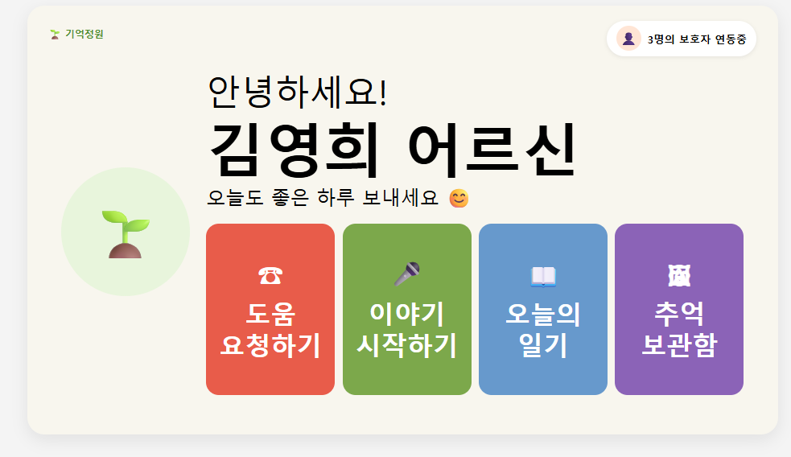

---

# 🏆 프로젝트 성과

- 2026 글로벌 피우다 프로젝트 공모전 참가
- 중간평가 통과

---

# 📖 프로젝트 소개

기억정원은 AI 회상 대화를 통해 어르신의 추억을 그림일기로 기록하고, 보호자가 웹에서 일기와 위험도 정보를 확인할 수 있도록 구성한 팀 프로젝트입니다.
어르신은 키오스크를 통해 AI와 대화를 진행하고 생성된 그림일기를 보호자에게 전송할 수 있으며, 보호자는 웹에서 최근 기록과 위험도 분석 결과를 확인할 수 있습니다.
본 저장소는 팀 프로젝트 전체가 아니라 제가 담당한 **프론트엔드(UI)** 부분만 별도로 정리한 포트폴리오입니다.

---

# 🎯 프로젝트 목표

- AI 기반 회상 대화 제공
- 그림일기 생성 및 조회
- 보호자와의 정보 공유
- 위험도 분석 결과 제공
- 고령자를 고려한 쉬운 사용자 인터페이스 구현

---

# ⚙️ 시스템 동작

## 1. 이야기 시작

어르신이 키오스크에서 **이야기 시작** 버튼을 눌러 AI 회상 대화를 시작합니다.

↓

## 2. AI 회상 대화

AI와 대화를 진행하며 추억을 회상합니다.

↓

## 3. 그림일기 생성

대화 내용을 기반으로 그림일기와 요약 정보가 생성됩니다.

↓

## 4. 보호자에게 전송

생성된 그림일기를 선택한 보호자에게 전송합니다.

↓

## 5. 보호자 웹 확인

보호자는 웹에서

- 최근 그림일기
- 위험도 분석
- AI 요약
- 감정 및 키워드

정보를 확인할 수 있습니다.

---

# ✨ 주요 기능

## 🖥️ 어르신용 키오스크

- AI 회상 대화
- 그림일기 조회
- 보호자에게 그림일기 전송
- 보호자 선택
- 긴급 도움 요청
- 추억보관함 조회

## 🌿 보호자용 웹

- 로그인 및 회원가입
- 어르신 연동
- 대시보드
- 그림일기 조회
- 주간 위험도 분석
- 캘린더 기반 기록 조회

---

# 🙋 담당 역할

- 어르신용 키오스크 UI/UX 설계 및 프론트엔드 구현
- 보호자용 웹 UI/UX 설계 및 프론트엔드 구현
- 사용자 정보 구조와 화면 흐름 설계
- 고령 사용자를 고려한 큰 글자와 버튼 중심 인터페이스 구현
- React와 TypeScript 기반 페이지 및 컴포넌트 개발
- CSS 기반 화면 스타일링
- 백엔드 REST API 연동
- API 응답 데이터의 상태 관리 및 화면 표시
- 로그인 인증 토큰을 활용한 API 요청 처리
- 버튼 이벤트와 화면 전환 로직 구현
- WebSocket을 통한 키오스크 상태 및 AI 응답 처리
- 보호자 연동, 일기 조회 및 보호자 전송 기능 구현

---

# 🛠️ 기술 스택

## Frontend

- React
- TypeScript
- CSS
- React Router
- React Calendar
- Recharts

## Communication

- REST API
- WebSocket

## Tools

- Git
- GitHub
- Create React App

---

# 📷 프로젝트 화면

## 🖥️ 키오스크 화면

### 1. 메인 화면

보호자 연동 상태를 확인하고 도움 요청, 이야기 시작, 오늘의 일기, 추억보관함 기능으로 이동할 수 있습니다.


---

### 2. 이야기 시작

어르신이 이야기 시작 버튼을 눌러 회상 대화를 시작할 수 있습니다.

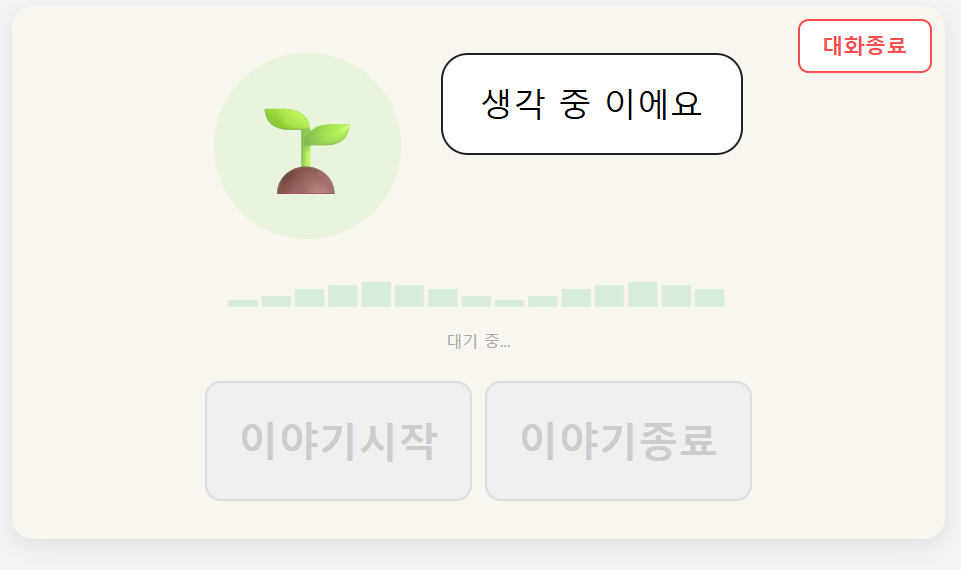

---

### 3. 오늘의 일기

생성된 그림과 일기 내용을 확인할 수 있습니다.

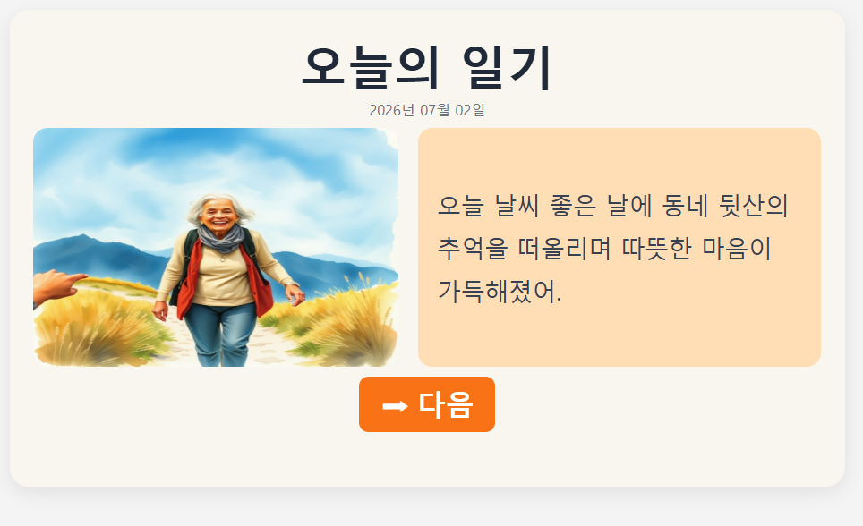

---

### 4. 가족에게 보내기

생성된 일기를 연동된 보호자에게 전송할 수 있습니다.

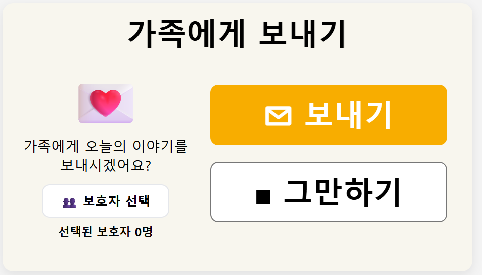

---

### 5. 보호자 선택

일기를 보낼 보호자를 선택할 수 있습니다.

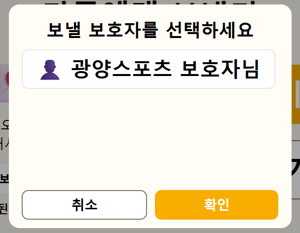

---

### 6. 전송 완료

보호자에게 일기가 전송되었음을 안내합니다.

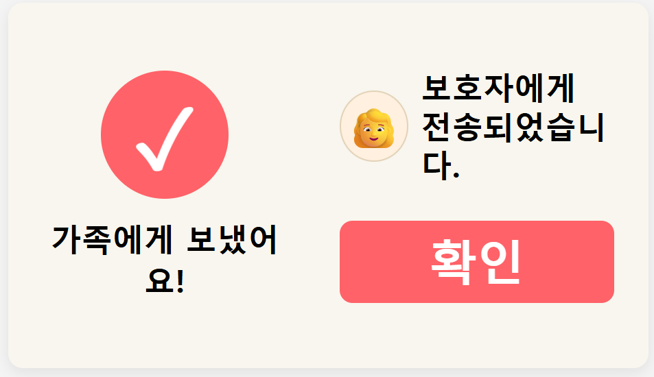

## 🌿 보호자용 웹 화면

### 1. 로그인

일반 로그인과 카카오 로그인을 지원하는 보호자 로그인 화면입니다.

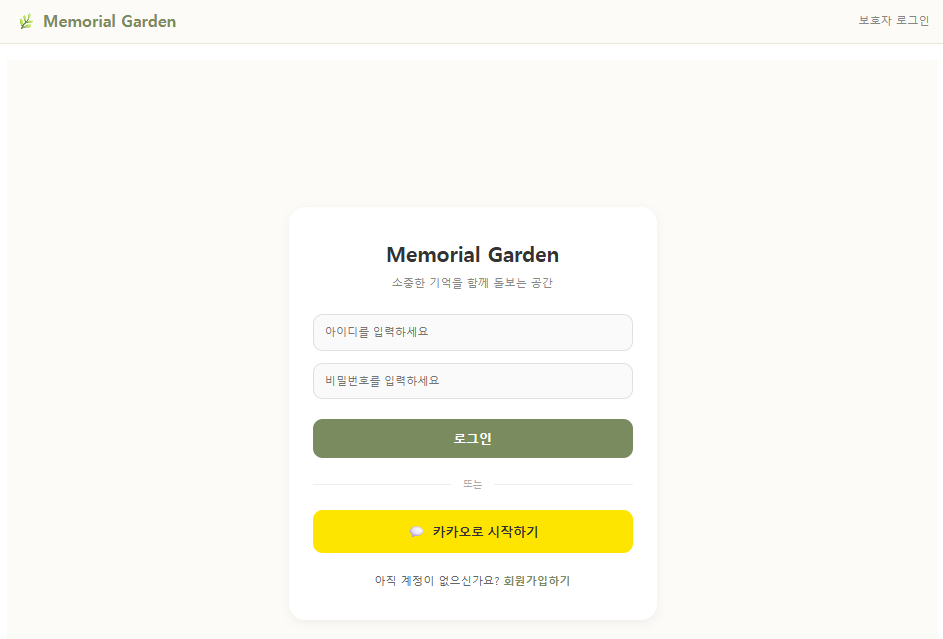

---

### 2. 보호자 대시보드

연동된 어르신의 최근 기록, 그림일기와 위험도 정보를 확인할 수 있습니다.


---

### 3. 어르신 연동 요청

어르신 계정을 검색하고 연동 요청 상태를 확인할 수 있습니다.

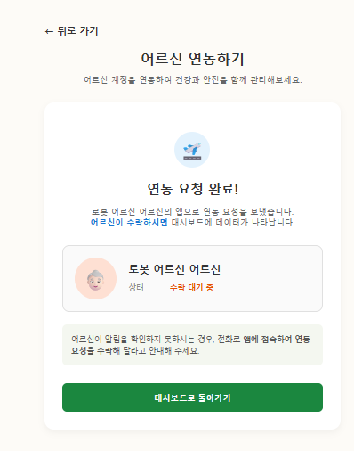

---

### 4. 주간 위험도 분석

최근 7일의 평균 위험도와 변화 추이, 종합 소견을 확인할 수 있습니다.

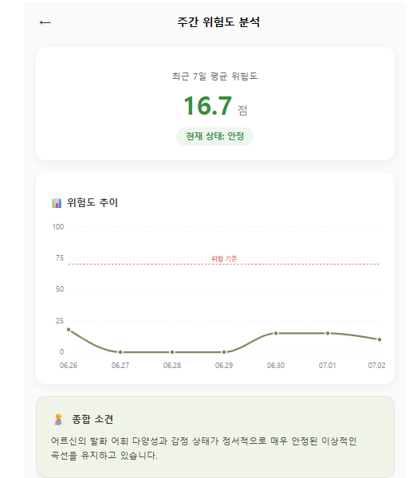

---

### 5. 그림일기 상세

선택한 날짜의 그림일기, AI 요약, 감정과 키워드를 확인할 수 있습니다.

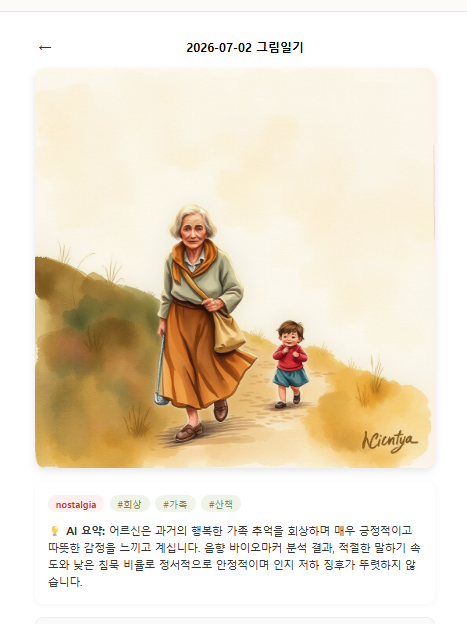

---

### 6. 위험도별 안내

위험도 점수에 따라 양호, 주의, 위험 단계와 보호자 행동 지침을 표시합니다.

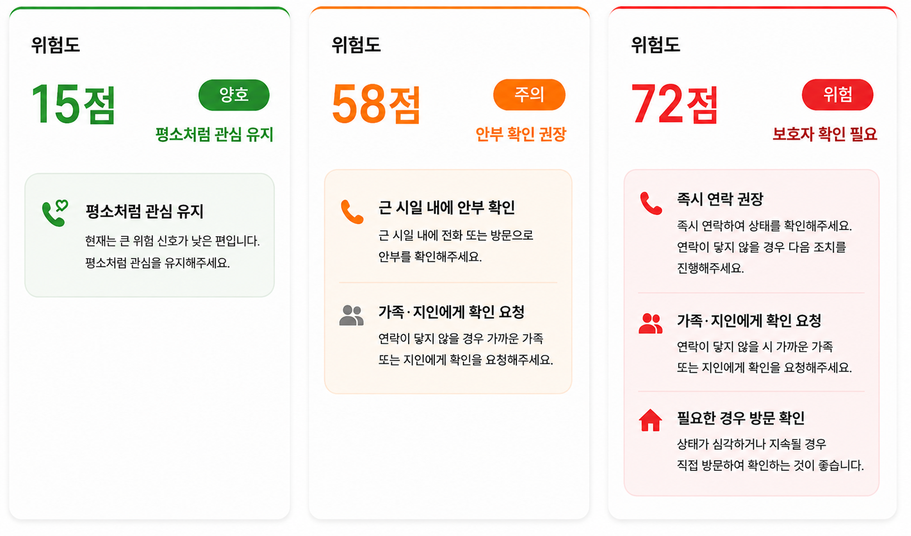

---

# 📂 저장소 구조

```text
memory-garden-frontend-portfolio/
├─ guardian-frontend/   # 보호자용 웹
├─ kiosk-frontend/      # 어르신용 키오스크
├─ images/              # 포트폴리오 화면 이미지
├─ .gitignore
└─ README.md
```

---

# 🚀 실행 방법

두 프론트엔드는 Create React App 기반이며 각각 따로 실행합니다.

## 보호자용 웹

```bash
cd guardian-frontend
npm install
npm start
```

## 어르신용 키오스크

```bash
cd kiosk-frontend
npm install
npm start
```

---

# ⚠️ 실행 안내

원본 팀 프로젝트는 Docker 환경에서 프론트엔드, 백엔드, AI 서버 및 데이터베이스를 함께 실행했습니다.
이 저장소에는 제가 담당한 프론트엔드 영역만 포함되어 있습니다. 백엔드 서버, 데이터베이스, AI 모델 및 하드웨어 코드는 포함되어 있지 않습니다.
따라서 프론트엔드 화면은 각각 `npm start`로 실행할 수 있지만 로그인, 데이터 조회, AI 대화, 그림일기 생성과 전송 등의 연동 기능은 별도의 백엔드 서버와 AI 서비스가 함께 실행되어야 전체 기능을 사용할 수 있습니다.

---

# 📌 프로젝트 구분

- 팀 프로젝트
- 담당 영역: 어르신용 키오스크와 보호자용 웹 UI/UX 및 프론트엔드 구현
- 저장소 범위: 취업 포트폴리오용 프론트엔드 분리본
- 백엔드 및 AI 모델 구현은 포함하지 않음